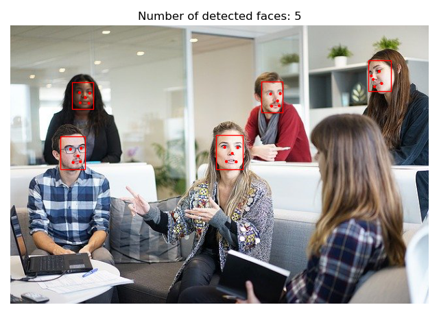

# MTCNN-pytorch
PyTorch implementation of [Multi Task CNN paper](https://arxiv.org/abs/1604.02878) for face detection.

# The algorithm
The algorithm performs 3 stage detection process. Each stage uses different CNN, therefore this detection system is represented as a cascade system of three CNNs.
Stages:
1. First CNN: P-Net (Proposal Network) produces initial guesses (candidates) for bounding boxes of faces, along with probabilities that those boxes contain a face. Some of the proposed candidates are rejected due to probability threshold and NMS. Bounding boxes are calibrated
2. Second CNN: R-Net (Refinement Network) refines former candidates in order to get a better estimate. Some of the proposed candidates are rejected due to probability threshold and NMS. Bounding boxes are calibrated
3. Third CNN: O-net (Output Network) outputs final estimates of bounding boxes and according facial landmark positions

CNNs are pretrained and used as such. This repo is an implementation of [Zhang's](https://kpzhang93.github.io/) work. The weights can be found in the [pretrained weights](src/pretrained_weights) folder.

# Results
 

 

# Instructions
1. Open Anaconda Prompt and navigate to the directory of this repo by using: ```cd PATH_TO_THIS_REPO ```
2. Execute ``` conda env create -f environment.yml ``` This will set up an environment with all necessary dependencies. 
3. Activate previously created environment by executing: ``` conda activate mtcnn-pytorch ```
4. Start the main script for face detection: ``` python main.py --img_loc PATH_TO_IMAGE ``` or just execute ``` python main.py ``` and use default locations for image. Default locations is: imgs/girls.jpg

# References
This repo is heavily inspired by these two repositories:
1. [MX Net implementation](https://github.com/YYuanAnyVision/mxnet_mtcnn_face_detection) of MTCNN
2. [PyTorch implementation](https://github.com/TropComplique/mtcnn-pytorch)
